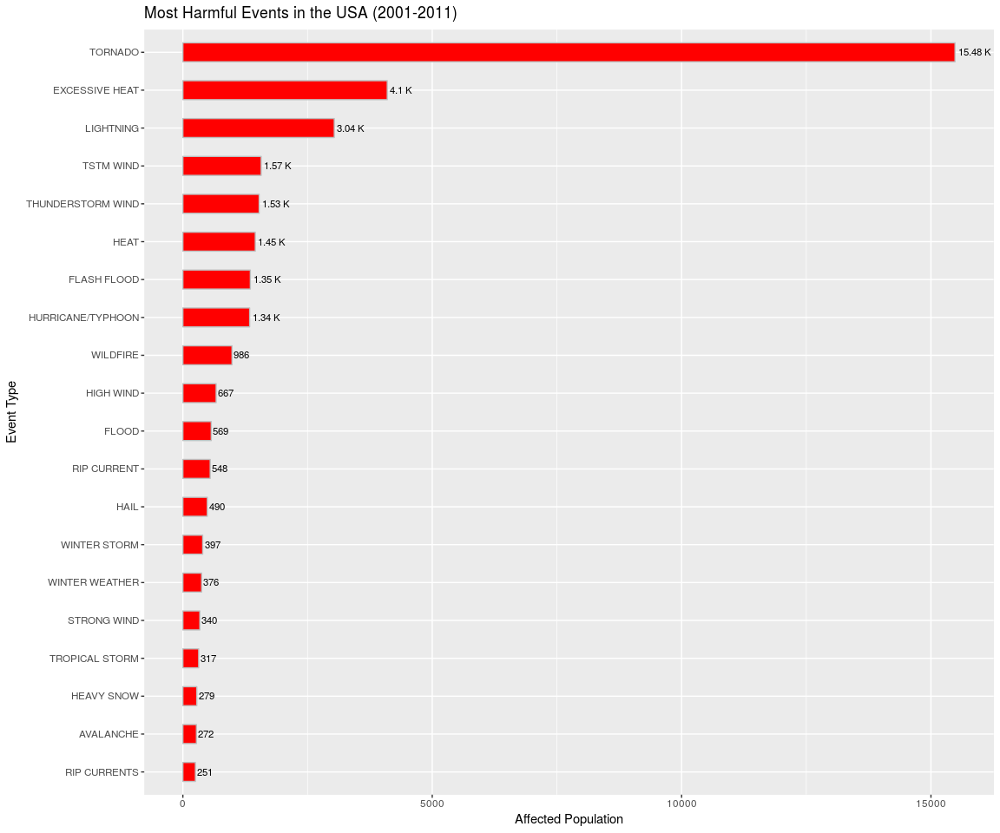
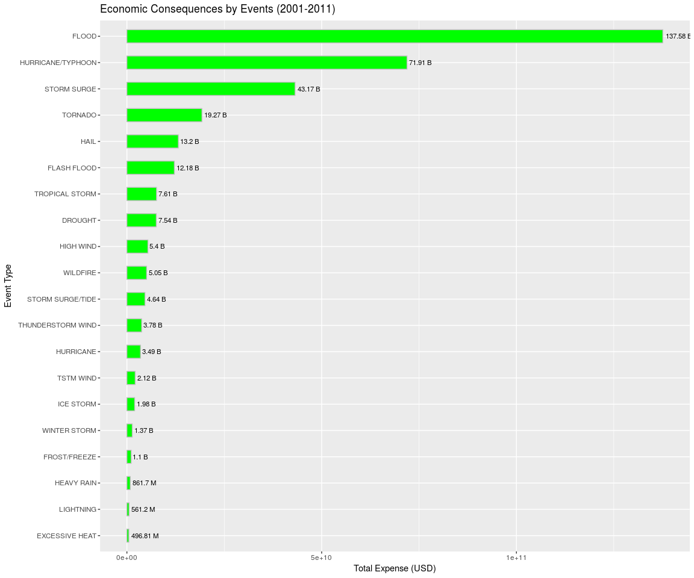
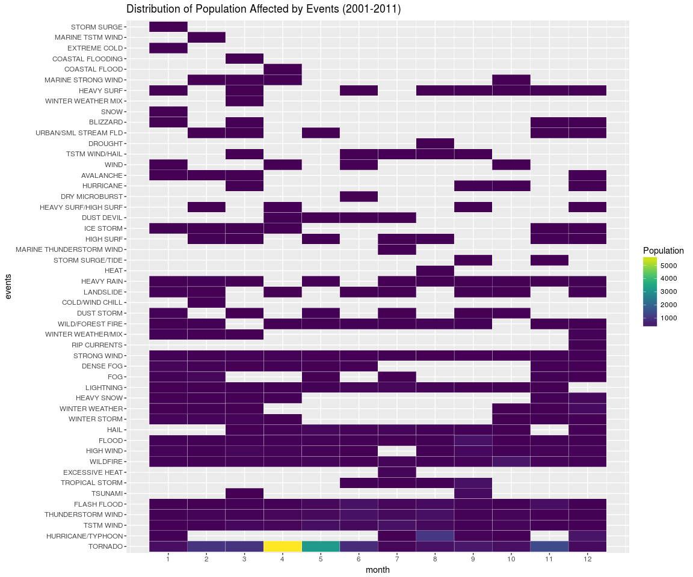

# NOAA Storm Analysis
Wagner Pinheiro  
February, 2017  

In this analysis, we will load and process the NOAA storm database to respond to the most damaging events in the United States for the last 10 years of data registries.

## Introduction

Storms and other severe weather events can cause both public health and economic problems for communities and municipalities. Many severe events can result in fatalities, injuries, and property damage, and preventing such outcomes to the extent possible is a key concern.

This project involves exploring the U.S. National Oceanic and Atmospheric Administration's (NOAA) storm database. This database tracks characteristics of major storms and weather events in the United States, including when and where they occur, as well as estimates of any fatalities, injuries, and property damage.

## Data Processing


```r
suppressPackageStartupMessages(library(dplyr))
suppressPackageStartupMessages(library(tidyr))
suppressPackageStartupMessages(library(ggplot2))
suppressPackageStartupMessages(library(lubridate))
suppressPackageStartupMessages(library(viridis))
suppressPackageStartupMessages(library(scales))

# convert big numbers to a power
# thanks to [42-](http://stackoverflow.com/questions/28159936/formatting-large-currency-or-dollar-values-to-millions-billions)
comprss <- function(tx) { 
      div <- findInterval(as.numeric(gsub("\\,", "", tx)), 
                          c(1, 1e3, 1e6, 1e9, 1e12) )
      paste(round( as.numeric(gsub("\\,","",tx))/10^(3*(div-1)), 2), 
           c("","K","M","B","T")[div] )}
```

Download the the zipped csv file with the dataset:

```r
# Set the default configuration settings
Config <- c()
Config$url <- 'https://d396qusza40orc.cloudfront.net/repdata%2Fdata%2FStormData.csv.bz2'
Config$data_path <- "./data/"
Config$file_zipped <- 'dataset.csv.bz2'
filename = paste0(Config$data_path, Config$file_zipped)
if(!file.exists(filename)){
  if(!dir.exists(Config$data_path)){
    dir.create(Config$data_path)
  }
  download.file(Config$url, filename)
}
paste('Compressed dataset size downloaded: ', trunc(file.size(filename) / (1024 ^ 2)), 'MB')
```

```
## [1] "Compressed dataset size downloaded:  46 MB"
```

Loading the dataset:

```r
dataset <- read.csv(filename)
dataset$BGN_DATE_D <- as.Date(dataset$BGN_DATE, format="%m/%d/%Y %T")
dataset$END_DATE_D <- as.Date(dataset$END_DATE, format="%m/%d/%Y %T")
str(dataset)
```

```
## 'data.frame':	902297 obs. of  39 variables:
##  $ STATE__   : num  1 1 1 1 1 1 1 1 1 1 ...
##  $ BGN_DATE  : Factor w/ 16335 levels "10/10/1954 0:00:00",..: 6523 6523 4213 11116 1426 1426 1462 2873 3980 3980 ...
##  $ BGN_TIME  : Factor w/ 3608 levels "000","0000","00:00:00 AM",..: 212 257 2645 1563 2524 3126 122 1563 3126 3126 ...
##  $ TIME_ZONE : Factor w/ 22 levels "ADT","AKS","AST",..: 7 7 7 7 7 7 7 7 7 7 ...
##  $ COUNTY    : num  97 3 57 89 43 77 9 123 125 57 ...
##  $ COUNTYNAME: Factor w/ 29601 levels "","5NM E OF MACKINAC BRIDGE TO PRESQUE ISLE LT MI",..: 13513 1873 4598 10592 4372 10094 1973 23873 24418 4598 ...
##  $ STATE     : Factor w/ 72 levels "AK","AL","AM",..: 2 2 2 2 2 2 2 2 2 2 ...
##  $ EVTYPE    : Factor w/ 985 levels "?","ABNORMALLY DRY",..: 830 830 830 830 830 830 830 830 830 830 ...
##  $ BGN_RANGE : num  0 0 0 0 0 0 0 0 0 0 ...
##  $ BGN_AZI   : Factor w/ 35 levels "","E","Eas","EE",..: 1 1 1 1 1 1 1 1 1 1 ...
##  $ BGN_LOCATI: Factor w/ 54429 levels "","?","(01R)AFB GNRY RNG AL",..: 1 1 1 1 1 1 1 1 1 1 ...
##  $ END_DATE  : Factor w/ 6663 levels "","10/10/1993 0:00:00",..: 1 1 1 1 1 1 1 1 1 1 ...
##  $ END_TIME  : Factor w/ 3647 levels "","?","0000",..: 1 1 1 1 1 1 1 1 1 1 ...
##  $ COUNTY_END: num  0 0 0 0 0 0 0 0 0 0 ...
##  $ COUNTYENDN: logi  NA NA NA NA NA NA ...
##  $ END_RANGE : num  0 0 0 0 0 0 0 0 0 0 ...
##  $ END_AZI   : Factor w/ 24 levels "","E","ENE","ESE",..: 1 1 1 1 1 1 1 1 1 1 ...
##  $ END_LOCATI: Factor w/ 34506 levels "","(0E4)PAYSON ARPT",..: 1 1 1 1 1 1 1 1 1 1 ...
##  $ LENGTH    : num  14 2 0.1 0 0 1.5 1.5 0 3.3 2.3 ...
##  $ WIDTH     : num  100 150 123 100 150 177 33 33 100 100 ...
##  $ F         : int  3 2 2 2 2 2 2 1 3 3 ...
##  $ MAG       : num  0 0 0 0 0 0 0 0 0 0 ...
##  $ FATALITIES: num  0 0 0 0 0 0 0 0 1 0 ...
##  $ INJURIES  : num  15 0 2 2 2 6 1 0 14 0 ...
##  $ PROPDMG   : num  25 2.5 25 2.5 2.5 2.5 2.5 2.5 25 25 ...
##  $ PROPDMGEXP: Factor w/ 19 levels "","-","?","+",..: 17 17 17 17 17 17 17 17 17 17 ...
##  $ CROPDMG   : num  0 0 0 0 0 0 0 0 0 0 ...
##  $ CROPDMGEXP: Factor w/ 9 levels "","?","0","2",..: 1 1 1 1 1 1 1 1 1 1 ...
##  $ WFO       : Factor w/ 542 levels "","2","43","9V9",..: 1 1 1 1 1 1 1 1 1 1 ...
##  $ STATEOFFIC: Factor w/ 250 levels "","ALABAMA, Central",..: 1 1 1 1 1 1 1 1 1 1 ...
##  $ ZONENAMES : Factor w/ 25112 levels "","                                                                                                                               "| __truncated__,..: 1 1 1 1 1 1 1 1 1 1 ...
##  $ LATITUDE  : num  3040 3042 3340 3458 3412 ...
##  $ LONGITUDE : num  8812 8755 8742 8626 8642 ...
##  $ LATITUDE_E: num  3051 0 0 0 0 ...
##  $ LONGITUDE_: num  8806 0 0 0 0 ...
##  $ REMARKS   : Factor w/ 436781 levels ""," ","  ","   ",..: 1 1 1 1 1 1 1 1 1 1 ...
##  $ REFNUM    : num  1 2 3 4 5 6 7 8 9 10 ...
##  $ BGN_DATE_D: Date, format: "1950-04-18" "1950-04-18" ...
##  $ END_DATE_D: Date, format: NA NA ...
```

Calculate the most harmful events to population, for the last 10 years of the dataset:

```r
evt_harmful_pop <- dataset %>%
  filter(BGN_DATE_D >= as.Date("2001-01-01")) %>%
  mutate(harm=FATALITIES+INJURIES) %>%
  group_by(EVTYPE) %>%
  summarise(total_harm = sum(harm), injuries=sum(INJURIES), fatalities=sum(FATALITIES)) %>%
  arrange(desc(total_harm)) %>%
  #mutate(total_harm_k=paste0(round(total_harm / 1000,digits=1), 'K'))
  mutate(total_harm_exp=comprss(total_harm))
  
head(evt_harmful_pop, 20)
```

```
## # A tibble: 20 × 5
##               EVTYPE total_harm injuries fatalities total_harm_exp
##               <fctr>      <dbl>    <dbl>      <dbl>          <chr>
## 1            TORNADO      15483    14331       1152        15.48 K
## 2     EXCESSIVE HEAT       4098     3242        856          4.1 K
## 3          LIGHTNING       3036     2622        414         3.04 K
## 4          TSTM WIND       1570     1478         92         1.57 K
## 5  THUNDERSTORM WIND       1530     1400        130         1.53 K
## 6               HEAT       1452     1222        230         1.45 K
## 7        FLASH FLOOD       1353      780        573         1.35 K
## 8  HURRICANE/TYPHOON       1339     1275         64         1.34 K
## 9           WILDFIRE        986      911         75           986 
## 10         HIGH WIND        667      557        110           667 
## 11             FLOOD        569      309        260           569 
## 12       RIP CURRENT        548      208        340           548 
## 13              HAIL        490      487          3           490 
## 14      WINTER STORM        397      321         76           397 
## 15    WINTER WEATHER        376      343         33           376 
## 16       STRONG WIND        340      243         97           340 
## 17    TROPICAL STORM        317      267         50           317 
## 18        HEAVY SNOW        279      256         23           279 
## 19         AVALANCHE        272      109        163           272 
## 20      RIP CURRENTS        251      158         93           251
```

Calculate the events with the greatest economic consequences, for the last 10 years of the dataset:


```r
PROPDMGEXP_DF <- data.frame(
  PROPDMGEXP=c("H","K","M","B"),
  PROPDMG_POWER=c(10^2,10^3,10^6,10^9)
)

CROPDMGEXP_DF <- data.frame(
  CROPDMGEXP=c("H","K","M","B"),
  CROPDMG_POWER=c(10^2,10^3,10^6,10^9)
)

evt_economic <- dataset %>%
  filter(BGN_DATE_D >= as.Date("2001-01-01")) %>%
  select(EVTYPE, PROPDMG, PROPDMGEXP, CROPDMG, CROPDMGEXP) %>%
  mutate(PROPDMGEXP=toupper(PROPDMGEXP), CROPDMGEXP=toupper(CROPDMGEXP)) %>%
  left_join(PROPDMGEXP_DF) %>%
  left_join(CROPDMGEXP_DF) %>%
  mutate(PROPDMG_POWER=ifelse(is.na(PROPDMG_POWER),as.integer(PROPDMGEXP), PROPDMG_POWER)) %>%
  mutate(CROPDMG_POWER=ifelse(is.na(CROPDMG_POWER),as.integer(CROPDMGEXP), CROPDMG_POWER)) %>%
  mutate(PROPDMG_POWER=ifelse(PROPDMG_POWER==0,1, PROPDMG_POWER)) %>%
  mutate(CROPDMG_POWER=ifelse(CROPDMG_POWER==0,1, CROPDMG_POWER)) %>%
  mutate(PROPDMG_POWER=ifelse(is.na(PROPDMG_POWER),1, PROPDMG_POWER)) %>%
  mutate(CROPDMG_POWER=ifelse(is.na(CROPDMG_POWER),1, CROPDMG_POWER)) %>%
  mutate(PROPDMG_REAL=PROPDMG * PROPDMG_POWER, CROPDMG_REAL=CROPDMG * CROPDMG_POWER) %>%
  mutate(DMG_TOTAL=PROPDMG_REAL + CROPDMG_REAL) %>%
  group_by(EVTYPE) %>%
  summarise_each(funs(sum), DMG_TOTAL, PROPDMG_REAL, CROPDMG_REAL) %>%
  arrange(desc(DMG_TOTAL)) %>%
  # mutate(DMG_TOTAL_EXP=paste0(round(DMG_TOTAL / 10^6,digits=1), 'M'))
  mutate(DMG_TOTAL_EXP=comprss(DMG_TOTAL))


head(evt_economic,20)
```

```
## # A tibble: 20 × 5
##               EVTYPE    DMG_TOTAL PROPDMG_REAL CROPDMG_REAL DMG_TOTAL_EXP
##               <fctr>        <dbl>        <dbl>        <dbl>         <chr>
## 1              FLOOD 137583726930 133972419530   3611307400      137.58 B
## 2  HURRICANE/TYPHOON  71913712800  69305840000   2607872800       71.91 B
## 3        STORM SURGE  43169775000  43169775000            0       43.17 B
## 4            TORNADO  19265009970  19037009560    228000410       19.27 B
## 5               HAIL  13203043160  11542618960   1660424200        13.2 B
## 6        FLASH FLOOD  12179310210  11343253710    836056500       12.18 B
## 7     TROPICAL STORM   7606531550   7194270550    412261000        7.61 B
## 8            DROUGHT   7543443000    845958000   6697485000        7.54 B
## 9          HIGH WIND   5395255480   4898423480    496832000         5.4 B
## 10          WILDFIRE   5054139800   4758667000    295472800        5.05 B
## 11  STORM SURGE/TIDE   4642038000   4641188000       850000        4.64 B
## 12 THUNDERSTORM WIND   3780985440   3382654440    398331000        3.78 B
## 13         HURRICANE   3486465010   3037505010    448960000        3.49 B
## 14         TSTM WIND   2122507560   1912483710    210023850        2.12 B
## 15         ICE STORM   1983414800   1974749800      8665000        1.98 B
## 16      WINTER STORM   1370919200   1370266200       653000        1.37 B
## 17      FROST/FREEZE   1103566000      9480000   1094086000         1.1 B
## 18        HEAVY RAIN    861703040    459157040    402546000       861.7 M
## 19         LIGHTNING    561203560    557922960      3280600       561.2 M
## 20    EXCESSIVE HEAT    496805200      4403200    492402000      496.81 M
```


## Results

1. Across the United States, which types of events (as indicated in the 𝙴𝚅𝚃𝚈𝙿𝙴 variable) are most harmful with respect to population health?


```r
# to-do: prepare data to stack bars
# evt_harmful_pop <- evt_harmful_pop[1:20,] %>%
  #gather(type_harm, count, injuries, fatalities)

ggplot(evt_harmful_pop[1:20,], aes(x=reorder(EVTYPE, total_harm), y=total_harm)) +
  geom_bar(stat='identity', col="gray", fill="red", width=0.5) +
  coord_flip() + 
  ggtitle("Most Harmful Events in the USA (2001-2011)") +
  xlab("Event Type") + 
  ylab("Affected Population") + 
  geom_text(aes(label=total_harm_exp), hjust=-0.1, size=3)
```

<!-- -->

 +
  scale_y_continuous(breaks= pretty_breaks())
1. Across the United States, which types of events have the greatest economic consequences?


```r
ggplot(evt_economic[1:20,], aes(x=reorder(EVTYPE, DMG_TOTAL), y=DMG_TOTAL)) +
  geom_bar(stat='identity', col="gray", fill="green", width=0.5) +
  coord_flip() + 
  ggtitle("Economic Consequences by Events (2001-2011)") +
  xlab("Event Type") + 
  ylab("Total Expense (USD)") + 
  geom_text(aes(label=DMG_TOTAL_EXP), hjust=-0.1, size=3)
```

<!-- -->

Heatmap of affected pouplation by month:


```r
full_top_evt <- dataset %>%
  filter(BGN_DATE_D >= as.Date("2001-01-01")) %>%
  select(EVTYPE, PROPDMG, PROPDMGEXP, CROPDMG, CROPDMGEXP, INJURIES, FATALITIES, BGN_DATE_D) %>%
  mutate(PROPDMGEXP=toupper(PROPDMGEXP), CROPDMGEXP=toupper(CROPDMGEXP)) %>%
  left_join(PROPDMGEXP_DF) %>%
  left_join(CROPDMGEXP_DF) %>%
  mutate(PROPDMG_POWER=ifelse(is.na(PROPDMG_POWER),as.integer(PROPDMGEXP), PROPDMG_POWER)) %>%
  mutate(CROPDMG_POWER=ifelse(is.na(CROPDMG_POWER),as.integer(CROPDMGEXP), CROPDMG_POWER)) %>%
  mutate(PROPDMG_POWER=ifelse(PROPDMG_POWER==0,1, PROPDMG_POWER)) %>%
  mutate(CROPDMG_POWER=ifelse(CROPDMG_POWER==0,1, CROPDMG_POWER)) %>%
  mutate(PROPDMG_POWER=ifelse(is.na(PROPDMG_POWER),1, PROPDMG_POWER)) %>%
  mutate(CROPDMG_POWER=ifelse(is.na(CROPDMG_POWER),1, CROPDMG_POWER)) %>%
  mutate(PROPDMG_REAL=PROPDMG * PROPDMG_POWER, CROPDMG_REAL=CROPDMG * CROPDMG_POWER) %>%
  mutate(DMG_TOTAL=PROPDMG_REAL + CROPDMG_REAL) %>%
  mutate(HARM_TOTAL=FATALITIES+INJURIES) %>%
  mutate(MONTH=month(BGN_DATE_D)) %>%
  filter(HARM_TOTAL > 0, DMG_TOTAL > 0) %>%
  group_by(MONTH, EVTYPE) %>%
  summarise_each(funs(sum), HARM_TOTAL, DMG_TOTAL) %>%
  arrange(desc(HARM_TOTAL), desc(DMG_TOTAL)) %>%
  mutate(HARM_TOTAL_EXP=comprss(HARM_TOTAL)) %>%
  mutate(DMG_TOTAL_EXP=comprss(DMG_TOTAL))

ggplot(full_top_evt, aes(MONTH, reorder(EVTYPE,-HARM_TOTAL) )) +
  geom_tile(aes(fill = HARM_TOTAL), color = "white") +
  scale_fill_viridis("Population") +
  scale_x_continuous(breaks=c(1:12), labels=c(1:12)) + #labels=month.name
  ggtitle("Distribution of Population Affected by Events (2001-2011)")+
  ylab("events") +
  xlab("month")
```

<!-- -->


Tornadoes are the biggest cause of threats to the population and to those causing great financial damage. Although they occur throughout the year, their greatest activity occurs in the months of March to May.
